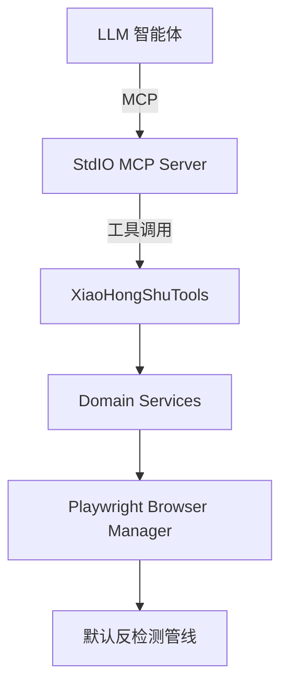

# 小红书 MCP 服务器系统设计说明书（SDS）
最后更新：2025-09-16

## 概述与目标
- 提供本地可控的 MCP 服务器外壳，仅保留与笔记读取和基础交互相关的核心能力；
- 强调标准化生态复用：Playwright、Polly、Serilog、官方 MCP SDK；
- 坚持“禁注入 + 拟人化交互”，删除治理与策略组件，专注于稳定、低检出的自动化流程。

## 架构与部署

- Gateway 通过标准输入/输出承载 MCP 连接；
- Tools 只负责委托领域服务，无入口治理逻辑；
- Services 统一复用强类型 IAuto* 通路与拟人化交互；
- Browser 层使用默认 Playwright Anti-Detection 管线，维持低检出基线。

## 数据流/时序与错误路径
1. Agent 触发 MCP 工具调用；
2. `McpToolExecutor` 负责基础日志包装与错误码映射；
3. 领域服务执行拟人化交互与 API 监听，必要时写入 Resumable Checkpoint；
4. 结果返回 MCP，日志记录由 Serilog 统一输出。

## 接口契约与错误码
- MCP 工具采用统一模型返回 `success/errorCode/message/requestId`；
- 超时或手动取消 → `ERR_TIMEOUT`；
- 参数校验失败 → `ERR_VALIDATION`；
- 其他异常 → `ERR_UNEXPECTED`。

## 数据模型与一致性/事务
- Resumable Checkpoint：JSON 文件持久化阶段状态，确保重入时可继续；
- 配置集中在 `XHS` 根节，通过 `XhsSettings` 单实例绑定。

## 观测性与容量规划
- 指标/日志：保留 Serilog 结构化日志与既有 Metric Hook（未做集中治理）；
- 并发控制：继续由 `XhsSettings.Concurrency` 与服务层限流/熔断负责，默认值需手动配置。

## 安全与合规
- 禁用 JS 注入与 outerHTML 导出，执行路径全部走拟人化交互；
- Playwright Anti-Detection Pipeline 保持启用，减少检测风险；
- 仅本地运行，不开启远端调用或额外治理模块。

## 风险与缓解
- 配置缺失：通过运行手册检查 `XHS` 节配置是否完整；
- 并发过载：调整 `XHS:Concurrency` 子节的速率与熔断参数；
- Playwright 漂移：持续监控 Resumable 日志与 Checkpoint，必要时更新选择器。

## 验收与发布
- 执行 `dotnet test Tests`，确保剩余单元测试全部通过且覆盖率维持 ≥ 90%；
- 确认标准 MCP 工具（搜索、详情、点赞、评论等）在本地端到端验证成功；
- 发布说明需涵盖配置项变更与回滚步骤（恢复旧版本即可）。
